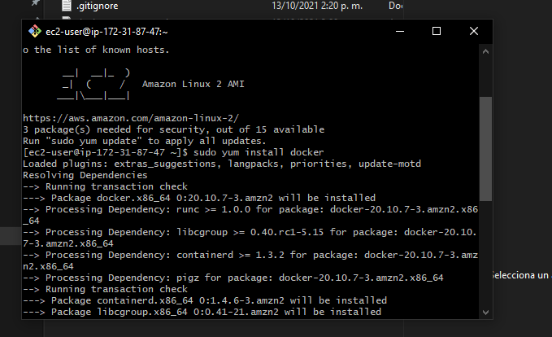
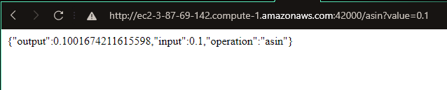
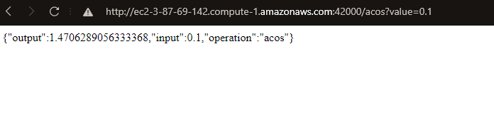

# Ec2AWS
parcial 2 arep
## Imagenes de consola AWS corriendo

[Video](https://youtu.be/e9k8usbtBig)

### Consola EC2

### asin

### acos

## Instalando

Entramos a la carpeta donde queremos guardar nuestro repositorio, en este caso Desktop

`$ cd Desktop`

Clonamos el repositorio en la carpeta

`$ git clone https://github.com/JuanC-358/Ec2AWS.git`

Nos dirigimos a la carpeta que contiene el proyecto

`$ cd Ec2AWS.git`

Compilamos con maven

`$ mvn package`

Correr proyecto

`$ mvn exec:java -Dexec.mainClass="com.edu.escuelaing.arep.ec2aws.WebServer"`

Para ejecutar la aplicación

`$ docker-compose up -d `
